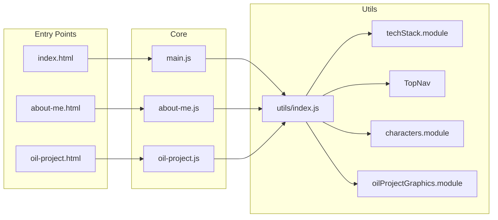

# Architecture Documentation

This document describes the architecture of the ET DEV portfolio project: a personal developer website built with Vite, vanilla JavaScript (ES modules), and Three.js.

---

## 1. High-Level Architecture

### Entry Points

The application is a **multi-page static site** with three entry points:

| Entry | Path | Page JS |
|-------|------|---------|
| Home | `index.html` | `main.js` |
| About Me | `pages/about-me/about-me.html` | `pages/about-me/about-me.js` |
| Oil Project | `pages/oil-project/oil-project.html` | `pages/oil-project/oil-project.js` |

Each page has its own HTML file and page-specific JavaScript. There is **no SPA router**; navigation is done via full page loads or hash links.

### Build Configuration

The build is configured in `vite.config.js` as a **Vite multi-page build** via `rollupOptions.input`:

- `main` → `./index.html`
- `aboutme` → `pages/about-me/about-me.html`
- `oilproject` → `pages/oil-project/oil-project.html`

Additional assets (GLB, GLTF, FBX, TTF) are included via `assetsInclude`.

### App Shell

Each page uses a single `#app` div. The page script injects markup with:

```js
document.querySelector('#app').innerHTML = `...`;
```

Then it initializes shared modules (e.g. TopNav, techStack, welcomeMessage, oilProjectGraphics). No shared app shell component is mounted; each page builds its own DOM and wires up behavior.

### Dependency Flow



---

## 2. Module Layout and Responsibilities

| Area | Path | Role |
|------|------|------|
| Barrel | `utils/index.js` | Re-exports techStack, welcomeMessage, characters, TopNav, topNavStyle, oilProjectGraphics |
| 3D Home/About | `utils/techStack.module.js` | Scene lifecycle, MyWorld (environment + tech text + rain), SceneControls (camera, bloom, handheld effect), FirstPersonCamera; paramaters class holds shared state |
| Character | `utils/characters.module.js` | BasicCharacterController, BasicCharacterControllerInput, CharacterFSM (Finite State Machine) with Idle/Walk/Run/Dance states |
| Nav UI | `utils/TopNav/topNav.module.js` | Custom element `<et-top-nav>`, Shadow DOM, nav-items attribute (JSON) |
| Welcome | `utils/welcomeMessage.module.js` | Rotating welcome messages during load |
| Oil project | `utils/oilProjectGraphics.module.js` | Standalone Three.js scene: pump jack (GLTF), moon, pipes, Chart.js integration, GSAP camera animations |

### Key Classes in techStack.module.js

- **techStack** – Orchestrates init, resize, loading manager, animate loop; creates MyWorld and SceneControls.
- **paramaters** – Holds scene config (camera positions, colors, bloom layer, loading manager, renderer, materials cache).
- **MyWorld** – Builds the 3D scene: GLB store, ground, rain (home only), tech stack text, ET DEV logo; optionally loads character; drives mixers and character update.
- **SceneControls** – Camera, OrbitControls, EffectComposer (bloom), finalComposer (mix pass), lights, fog; centerCamera, handheld effect, flickerStack.
- **FirstPersonCamera** – FPS-style camera with InputController (keyboard/mouse); used for optional pointer-lock mode (currently not wired in UI).

### Key Classes in characters.module.js

- **BasicCharacterController** – Loads FBX character and animations, updates position/rotation from input, drives AnimationMixer.
- **BasicCharacterControllerInput** – Key state (forward, backward, left, right, space, shift); key listeners are present but commented out.
- **CharacterFSM** – Finite State Machine with Idle, Walk, Run, Dance states; uses BasicCharacterControllerProxy to access animations.
- **State** subclasses – IdleState, WalkState, RunState, DanceState; handle Enter/Exit/Update and animation crossfades.

---

## 3. Data and Asset Flow

### Fonts

- Stored in `public/` as JSON (e.g. Tilt Neon_Regular.json, Michroma_Regular.json, Heebo Black_Regular.json).
- Loaded at runtime via Three.js `FontLoader`; paths are root-relative (e.g. `/Tilt Neon_Regular.json`).

### 3D Assets

- **GLB/GLTF/FBX** live under `utils/scenes/` (e.g. cyberpunk store, monster FBX set, oil pump jack).
- Assets are **imported as ES module URLs** in the source (e.g. `import CoffeeShop from './scenes/247_cyberpunk_store_lowres.glb'`) and passed to GLTFLoader/FBXLoader.
- Vite resolves these imports and serves the correct URLs in dev and build.

### Oil Project Data

- **public/three.txt** – Pipe list/data for the oil project scene (fetched at runtime, parsed as JSON).
- **public/threeChart.txt** – Chart data (overallX, overallY, overallColor) for Chart.js (fetched at runtime, parsed as JSON).

---

## 4. Design Patterns

| Pattern | Where | Description |
|--------|--------|-------------|
| **Module pattern** | All `utils/*.module.js`, `utils/index.js` | ES modules with barrel export from `utils/index.js`. |
| **Class-based OOP** | techStack, MyWorld, SceneControls, BasicCharacterController, oilProjectGraphics | Core 3D and character logic is organized in classes; `paramaters` holds config/state for the main 3D scene. |
| **Finite State Machine (FSM)** | `utils/characters.module.js` | CharacterFSM and State subclasses (Idle, Walk, Run, Dance); BasicCharacterControllerProxy exposes animations to the FSM. |
| **Custom Elements (Web Components)** | `utils/TopNav/topNav.module.js` | `<et-top-nav>` with Shadow DOM; `observedAttributes` for `nav-items` (JSON string). |
| **Factory / initialization flow** | techStack._Init(), triggerTechStack() | _Init() sets up renderer, loading manager, resize; triggerTechStack() creates MyWorld and SceneControls, starts animate loop, wires scroll/release button; loading manager callbacks drive progress UI and post-load behavior (e.g. centerCamera, flickerStack). |
| **Post-processing pipeline** | SceneControls in techStack.module.js | Two composers: bloom pass vs. base; scene is traversed to swap materials for bloom layer, then restored each frame. |

---

## 5. Known Code Issues (Maintainability)

- **techStack.module.js**: The helpers `nonBloomed` and `restoreMaterial` (and the paramaters-based bloom logic) reference **global** `materials` and `darkMaterial` in some code paths. The main animate loop correctly uses `this.params.materials` and `this.params.darkMaterial`. This inconsistent use of globals vs. params should be unified to avoid subtle bugs (e.g. if multiple scenes were ever instantiated).
- **Naming**: The class name `paramaters` is a typo for "parameters"; renaming to `parameters` (or e.g. `TechStackParams`) would improve readability.

### Recommended Follow-ups

- Refactor bloom material swap/restore to use only `this.params.materials` and `this.params.darkMaterial` (remove global references).
- Rename `paramaters` to a consistent name (e.g. `parameters` or `TechStackParams`).
